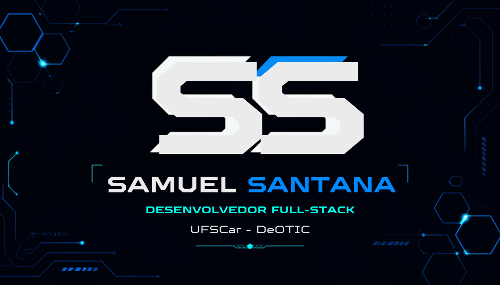

# 🎴 Cartão de Visita em Realidade Aumentada

> Projeto pessoal de **Realidade Aumentada (AR)** que transforma um cartão de visita físico em uma experiência interativa 3D com voz.

---

## 👨‍💻 Sobre mim

**Samuel Santana**
- 💻 Desenvolvedor Full-Stack
- 🏢 UFSCar — DeOTIC (Departamento de Organização e Tratamento da Informação e Conhecimento)
- 🎯 Especializando em Back-end com **Java** e **Spring Boot**
- 🌱 Estudando **Spring Security**, **Microsserviços** e **AWS**

📫 **Contatos:**
- 🐙 GitHub: [@Sah123campos](https://github.com/Sah123campos)
- 💼 LinkedIn: [samuel-santana-7623402b8](https://www.linkedin.com/in/samuel-santana-7623402b8/)
- 📸 Instagram: [@_samusantana_](https://www.instagram.com/_samusantana_/)

---

## 🚀 Como usar

### 📱 Passo 1: Abra o projeto no celular

Acesse a URL do projeto pelo **navegador do celular** (Chrome no Android ou Safari no iOS):

> 🔗 **[cole aqui a URL do Netlify ou GitHub Pages]**

⚠️ **Importante:** a câmera só funciona em **HTTPS** ou **localhost**. Não tente abrir o `index.html` direto pelo gerenciador de arquivos do celular.

---

### 🖼️ Passo 2: Escaneie o marcador

Para ver o cartão AR aparecer, **aponte a câmera do celular para a imagem abaixo** (`marcador.jpeg`):

**Dicas para reconhecer mais rápido:**
- 📏 Mantenha uma distância de **20 a 40 cm** do marcador
- 💡 Use em ambiente **bem iluminado**
- 🖥️ Pode ser o **monitor do computador** exibindo a imagem, ou uma **impressão em papel**
- ⚠️ Evite **reflexos** e **brilho** sobre o marcador
- 🔄 Se demorar, aproxime ou afaste lentamente a câmera

---

### 🎉 Passo 3: Interaja!

Quando o marcador for reconhecido, você vai ver:

| Elemento | Descrição |
|----------|-----------|
| 🟦 **Borda azul neon** | Moldura luminosa ao redor do cartão |
| ⬛ **Placa 3D escura** | O corpo do cartão com espessura real |
| 🖼️ **Imagem do cartão** | O marcador colado na frente da placa |
| 🔵 **SAMUEL SANTANA** | Nome saltando em 3D |
| ⚪ **Desenvolvedor Full-Stack** | Cargo em relevo |
| 🟡 **UFSCar · DeOTIC** | Instituição em relevo |
| 💠 **Back-end com Java + Spring Boot** | Especialização |
| ⚫ **Web · Mobile · APIs · Cloud** | Áreas de atuação |
| 🔊 **Voz** | Apresentação falada automaticamente |
| 📱 **Botões** | Acesso rápido ao GitHub, LinkedIn e Instagram |

**Interações disponíveis:**
- 👆 **Arraste o dedo** sobre o cartão para girá-lo
- 🔊 Toque no botão **"Ouvir apresentação"** para repetir a fala
- 🔗 Toque nos botões de **GitHub**, **LinkedIn** ou **Instagram** para abrir seus perfis

---

## 🛠️ Tecnologias utilizadas

| Tecnologia | Função |
|------------|--------|
| [A-Frame 1.6.0](https://aframe.io/) | Framework de cenas 3D em HTML |
| [MindAR 1.2.5](https://hiukim.github.io/mind-ar-js-doc/) | Reconhecimento de imagem (AR) |
| [Web Speech API](https://developer.mozilla.org/pt-BR/docs/Web/API/SpeechSynthesis) | Síntese de voz nativa do navegador |

---

## 📁 Estrutura do projeto
